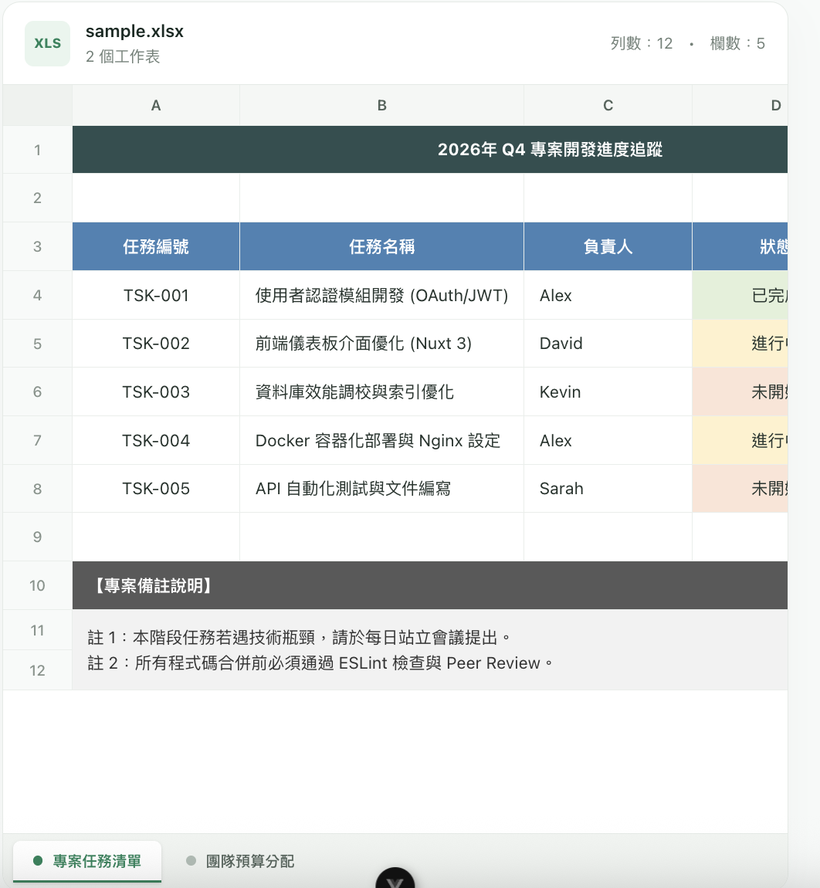
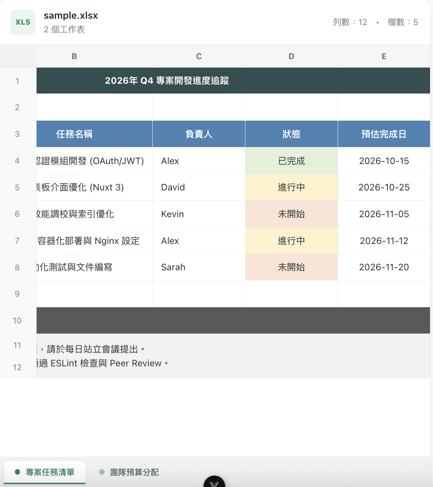

# README

- dependencies
  - TailwindCSS
  - ExcelJS

### SAMPLE

[sample.xlsx](./src/assets/samples/sample.xlsx)





### Columns

```json
columns: [ "A", "B", "C", "D", "E" ]
```

### Rows

```json
rows: [ { "number": 1, "cells": [ "2026年 Q4 專案開發進度追蹤", "2026年 Q4 專案開發進度追蹤", "2026年 Q4 專案開發進度追蹤", "2026年 Q4 專案開發進度追蹤", "2026年 Q4 專案開發進度追蹤" ] }, { "number": 2, "cells": [] }, { "number": 3, "cells": [ "任務編號", "任務名稱", "負責人", "狀態", "預估完成日" ] }, { "number": 4, "cells": [ "TSK-001", "使用者認證模組開發 (OAuth/JWT)", "Alex", "已完成", "2026-10-15" ] }, { "number": 5, "cells": [ "TSK-002", "前端儀表板介面優化 (Nuxt 3)", "David", "進行中", "2026-10-25" ] }, { "number": 6, "cells": [ "TSK-003", "資料庫效能調校與索引優化", "Kevin", "未開始", "2026-11-05" ] }, { "number": 7, "cells": [ "TSK-004", "Docker 容器化部署與 Nginx 設定", "Alex", "進行中", "2026-11-12" ] }, { "number": 8, "cells": [ "TSK-005", "API 自動化測試與文件編寫", "Sarah", "未開始", "2026-11-20" ] }, { "number": 9, "cells": [] }, { "number": 10, "cells": [ "【專案備註說明】", "【專案備註說明】", "【專案備註說明】", "【專案備註說明】", "【專案備註說明】" ] }, { "number": 11, "cells": [ "註 1：本階段任務若遇技術瓶頸，請於每日站立會議提出。\n註 2：所有程式碼合併前必須通過 ESLint 檢查與 Peer Review。", "註 1：本階段任務若遇技術瓶頸，請於每日站立會議提出。\n註 2：所有程式碼合併前必須通過 ESLint 檢查與 Peer Review。", "註 1：本階段任務若遇技術瓶頸，請於每日站立會議提出。\n註 2：所有程式碼合併前必須通過 ESLint 檢查與 Peer Review。", "註 1：本階段任務若遇技術瓶頸，請於每日站立會議提出。\n註 2：所有程式碼合併前必須通過 ESLint 檢查與 Peer Review。", "註 1：本階段任務若遇技術瓶頸，請於每日站立會議提出。\n註 2：所有程式碼合併前必須通過 ESLint 檢查與 Peer Review。" ] }, { "number": 12, "cells": [ "註 1：本階段任務若遇技術瓶頸，請於每日站立會議提出。\n註 2：所有程式碼合併前必須通過 ESLint 檢查與 Peer Review。", "註 1：本階段任務若遇技術瓶頸，請於每日站立會議提出。\n註 2：所有程式碼合併前必須通過 ESLint 檢查與 Peer Review。", "註 1：本階段任務若遇技術瓶頸，請於每日站立會議提出。\n註 2：所有程式碼合併前必須通過 ESLint 檢查與 Peer Review。", "註 1：本階段任務若遇技術瓶頸，請於每日站立會議提出。\n註 2：所有程式碼合併前必須通過 ESLint 檢查與 Peer Review。", "註 1：本階段任務若遇技術瓶頸，請於每日站立會議提出。\n註 2：所有程式碼合併前必須通過 ESLint 檢查與 Peer Review。" ] } ];
```
